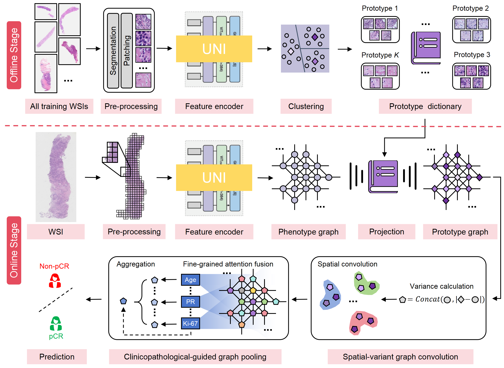

# CSV-Net

## Interpretable Graph Learning on Preoperative Biopsy for Prediction of Pathological Complete Response to Neoadjuvant Therapy in Breast Cancer

<div align=left></div>

## Installation
Clone the repo:
```bash
git clone https://github.com/Houwentai/CSV_Net && cd CSV_Net
```
Create a conda environment and activate it:
```bash
conda create -n env python=3.10
conda activate env
pip install -r requirements.txt
```

## Offline stage
- **WSI preprocessing and Feature Embedding** 
  - [CLAM](https://github.com/mahmoodlab/CLAM)--Lu, M.Y., Williamson, D.F.K., Chen, T.Y. et al. Data-efficient and weakly supervised computational pathology on whole-slide images. Nat Biomed Eng 5, 555–570 (2021).

- **Prototype Extraction**
```bash
python train.py
```

## Online stage
- **Construction of Phenotype Graph and Prototype Graph**


First, setting the data splits and hyperparameters in the file ***train.py***. Then, experiments can be run using the following command-line:
```bash
cd train
python train.py
```
The trained model will be saved in the folder ***Saved_model***. 

## Saved model
We provide our trained CSV_Net model, which performing as:
| Dataset | ROC-AUC |
| ----- |:--------:|
| Internel validation set | 0.845 |
| Externel validation set | 0.815 |

## Inference
Using the following command-line for model inference and result statistics:
```bash
cd inference
python inference.py
```

## Citation
- If you found our work useful in your research, please consider citing our work at:
```
TBD
```
